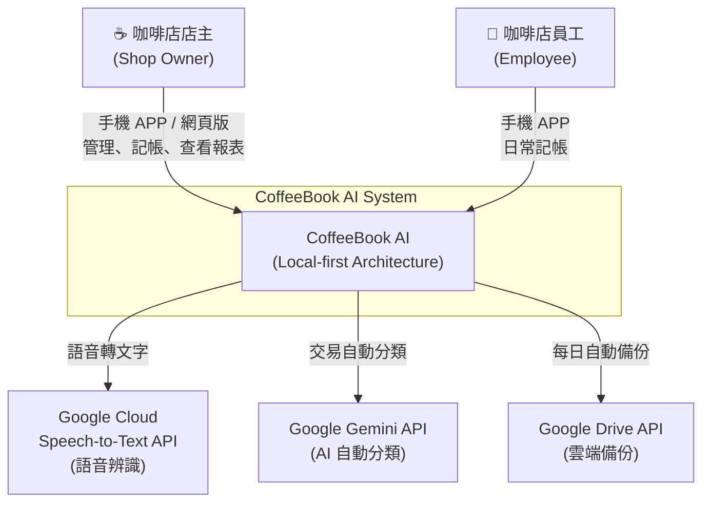
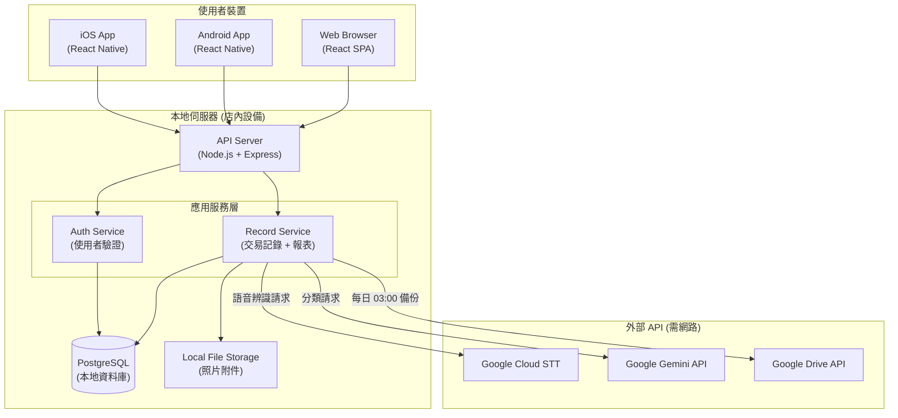
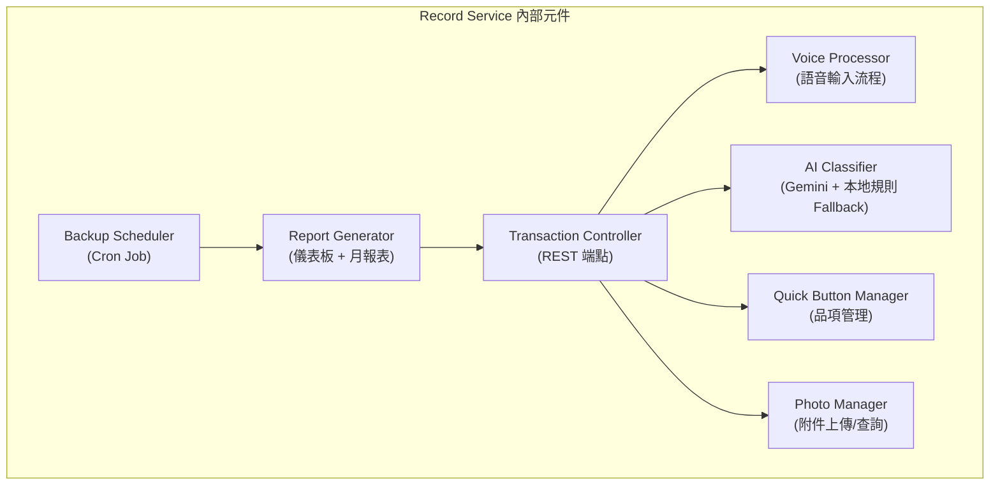
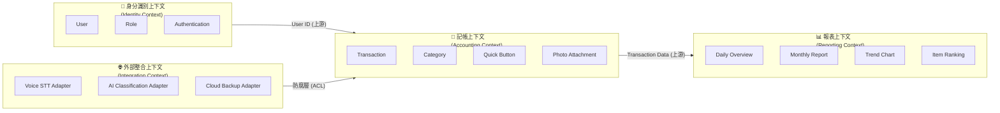
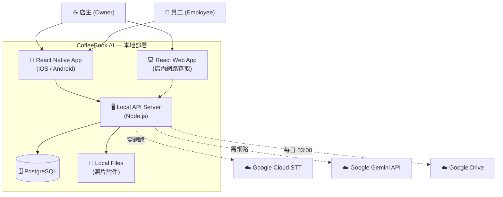
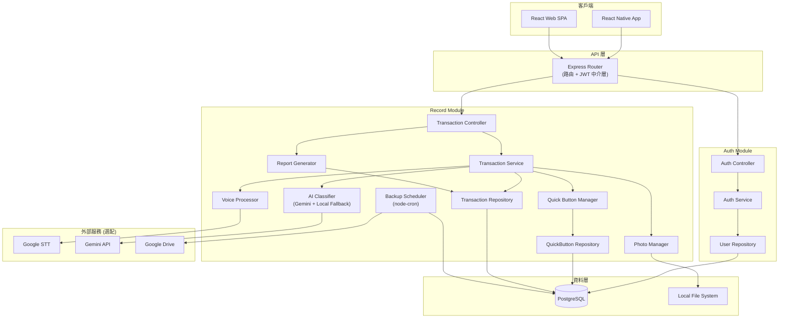
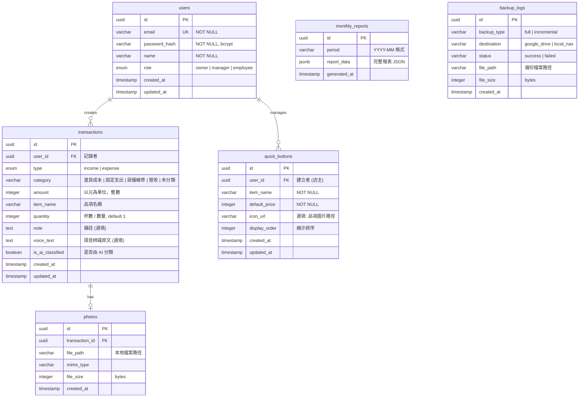
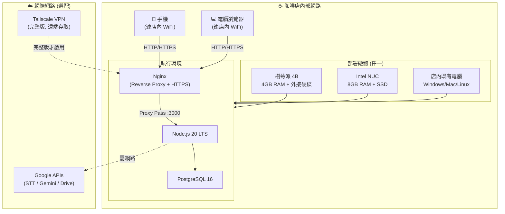

# 整合性架構與設計文件 (Unified Architecture & Design Document) - 家庭咖啡店智能記帳系統

---

**文件版本 (Document Version):** `v1.0`
**最後更新 (Last Updated):** `2026-02-11`
**主要作者 (Lead Author):** `[技術架構師 / Lead Engineer]`
**審核者 (Reviewers):** `[PM, Backend Engineer, UX Designer]`
**狀態 (Status):** `草稿 (Draft)`
**對應 PRD:** `02_prd.md v1.5`
**專案代號:** `CB-2026-Q1`

---

## 目錄 (Table of Contents)

- [第 1 部分：架構總覽 (Architecture Overview)](#第-1-部分架構總覽-architecture-overview)
  - [1.1 C4 模型：視覺化架構](#11-c4-模型視覺化架構)
  - [1.2 DDD 戰略設計 (Strategic DDD)](#12-ddd-戰略設計-strategic-ddd)
  - [1.3 Clean Architecture 分層](#13-clean-architecture-分層)
  - [1.4 技術選型與決策](#14-技術選型與決策)
- [第 2 部分：需求摘要 (Requirements Summary)](#第-2-部分需求摘要-requirements-summary)
  - [2.1 功能性需求摘要](#21-功能性需求摘要-functional-requirements-summary)
  - [2.2 非功能性需求](#22-非功能性需求-non-functional-requirements---nfrs)
- [第 3 部分：高層次架構設計 (High-Level Architectural Design)](#第-3-部分高層次架構設計-high-level-architectural-design)
  - [3.1 選定的架構模式](#31-選定的架構模式-chosen-architectural-pattern)
  - [3.2 系統上下文圖](#32-系統上下文圖-system-context-diagram)
  - [3.3 系統組件圖](#33-系統組件圖-system-component-diagram)
  - [3.4 主要組件職責](#34-主要組件服務職責-key-componentsservices-responsibilities)
  - [3.5 關鍵用戶旅程](#35-關鍵用戶旅程與組件交互-key-user-journeys)
- [第 4 部分：技術選型詳述 (Technology Stack Details)](#第-4-部分技術選型詳述-technology-stack-details)
- [第 5 部分：數據架構 (Data Architecture)](#第-5-部分數據架構-data-architecture)
- [第 6 部分：部署與基礎設施架構 (Deployment & Infrastructure)](#第-6-部分部署與基礎設施架構-deployment-and-infrastructure-architecture)
- [第 7 部分：跨領域考量 (Cross-Cutting Concerns)](#第-7-部分跨領域考量-cross-cutting-concerns)
- [第 8 部分：風險與緩解策略 (Risks and Mitigation)](#第-8-部分風險與緩解策略-risks-and-mitigation)
- [第 9 部分：架構演進路線圖 (Architecture Evolution Roadmap)](#第-9-部分架構演進路線圖-architecture-evolution-roadmap)
- [第 10 部分：詳細設計 (Detailed Design)](#第-10-部分詳細設計-detailed-design)
- [附錄 (Appendices)](#附錄-appendices)

---

**目的**: 本文件旨在將「家庭咖啡店智能記帳系統 (CoffeeBook AI)」的業務需求轉化為一個完整、內聚的技術藍圖。它從高層次的系統架構開始，逐步深入到具體的模組級實現細節，確保系統的穩固性與可維護性。本系統採用**本地優先 (Local-first)** 的單店專屬部署架構。

---

## 第 1 部分：架構總覽 (Architecture Overview)

*此部分關注系統的宏觀結構與指導原則，回答「系統由什麼組成？」以及「它們之間如何互動？」。*

### 1.1 C4 模型：視覺化架構

#### L1 - 系統情境圖 (System Context Diagram)

描述 CoffeeBook AI 系統與外部使用者及外部服務的互動。



**說明：**
- 店主與員工透過 React Native 手機 APP 或 React 網頁版與系統互動
- 系統部署在店內設備上 (樹莓派 / NUC / PC)，所有核心資料儲存在本地
- 外部服務 (Google STT、Gemini、Drive) 僅在有網路時使用，非核心依賴

---

#### L2 - 容器圖 (Container Diagram)

描述系統由哪些可部署單元組成。



**說明：**
- **API Server**：統一的 HTTP/REST 入口，處理路由、認證中介層
- **Auth Service**：使用者註冊、登入、JWT Token 管理、角色權限
- **Record Service**：交易 CRUD、語音輸入處理、AI 分類代理、報表生成、備份排程
- **PostgreSQL**：本地持久化所有結構化資料
- **Local File Storage**：儲存照片附件 (收據、發票)

---

#### L3 - 元件圖 (Component Diagram) — Record Service 內部



---

### 1.2 DDD 戰略設計 (Strategic DDD)

#### 通用語言 (Ubiquitous Language)

| 術語 | 定義 | 英文對應 |
| :--- | :--- | :--- |
| **交易 (Transaction)** | 一筆收入或支出記錄 | Transaction |
| **收入 (Income)** | 銷售飲品產生的營收 | Income/Revenue |
| **支出 (Expense)** | 進貨、固定開銷、維修等花費 | Expense |
| **品項 (Item)** | 咖啡店販售的飲品或商品 | Item/Product |
| **快速按鈕 (Quick Button)** | 主畫面上的一鍵記帳捷徑 | Quick Button |
| **分類 (Category)** | 交易的類型歸屬 (進貨成本、固定支出、設備維修、營收) | Category |
| **備註 (Note)** | 交易的補充說明文字 (如：咖啡豆、房租) | Note |
| **店主 (Owner)** | 擁有最高權限的使用者，可管理帳號與查看報表 | Owner |
| **員工 (Employee)** | 只能記帳、不能查看報表的使用者 | Employee |
| **管理者 (Manager)** | 可記帳且可查看報表的員工角色 | Manager |
| **月報表 (Monthly Report)** | 系統每月 1 日自動產生的財務摘要 | Monthly Report |
| **週同比 (Week-over-Week)** | 與上週同一天的數據比較 | WoW Comparison |
| **淨利 (Net Profit)** | 總收入減去總支出 | Net Profit |

---

#### 限界上下文 (Bounded Contexts)



**上下文關係說明：**
- **Identity → Accounting**：上下游關係。Accounting Context 使用 User ID 標記記錄者，但不關心身分驗證的實作細節
- **Accounting → Reporting**：上下游關係。Reporting 只讀取 Transaction 資料，不寫入
- **Integration → Accounting**：防腐層 (Anti-Corruption Layer)。外部 API (Google STT / Gemini / Drive) 的回傳格式透過 Adapter 轉譯為內部 Domain 物件，隔離外部變更影響

---

### 1.3 Clean Architecture 分層

本系統遵循 Clean Architecture 原則，確保關注點分離，讓核心業務邏輯不依賴外部框架或 I/O。

```
┌──────────────────────────────────────────────┐
│              Presentation Layer               │
│  (React Native App / React Web / REST API)    │
├──────────────────────────────────────────────┤
│              Application Layer                │
│  (Use Cases / Application Services)           │
│  - CreateTransactionUseCase                   │
│  - GenerateMonthlyReportUseCase               │
│  - ClassifyExpenseUseCase                     │
│  - ManageQuickButtonUseCase                   │
│  - AuthenticateUserUseCase                    │
├──────────────────────────────────────────────┤
│              Domain Layer                     │
│  (Entities / Value Objects / Domain Services) │
│  - Transaction (Aggregate Root)               │
│  - User (Aggregate Root)                      │
│  - QuickButton (Entity)                       │
│  - Category (Value Object)                    │
│  - Money (Value Object)                       │
├──────────────────────────────────────────────┤
│              Infrastructure Layer             │
│  (Repository Impl / External API Adapters)    │
│  - PostgresTransactionRepository              │
│  - PostgresUserRepository                     │
│  - GoogleSTTAdapter                           │
│  - GeminiClassifierAdapter                    │
│  - LocalKeywordClassifier (Fallback)          │
│  - GoogleDriveBackupAdapter                   │
│  - LocalFileStorageAdapter                    │
└──────────────────────────────────────────────┘
```

**依賴規則 (Dependency Rule)：** 所有依賴方向向內。Infrastructure 依賴 Domain 的介面 (Port)，Domain 不知道 Infrastructure 的存在。

---

### 1.4 技術選型與決策

詳見 [第 4 部分](#第-4-部分技術選型詳述-technology-stack-details) 與 PRD 已決策事項 (D-001 ~ D-016)。

---

## 第 2 部分：需求摘要 (Requirements Summary)

### 2.1 功能性需求摘要 (Functional Requirements Summary)

| 需求 ID | 功能描述 | 對應 User Story | 優先級 |
| :--- | :--- | :--- | :--- |
| FR-1 | 語音輸入記帳 (STT → 自動解析金額/品項/分類) | US-101 | P0 |
| FR-2 | 快速按鈕一鍵記錄銷售 (含修改杯數/售價) | US-102 | P0 |
| FR-3 | AI 自動分類支出 (Gemini + 本地規則 Fallback) | US-103 | P0 |
| FR-4 | 照片附件 (拍照/相簿 → 綁定交易記錄) | US-104 | P1 |
| FR-5 | 自訂快速按鈕 (CRUD + 拖曳排序 + 圖片上傳) | US-105 | P0 |
| FR-6 | 每日概覽儀表板 (營收/杯數/淨利/週同比) | US-201 | P0 |
| FR-7 | 營收趨勢折線圖 (7 日 / 30 日切換) | US-202 | P1 |
| FR-8 | 今日品項銷售排行 Top 3 | US-203 | P1 |
| FR-9 | 月報表自動生成 (每月 1 日 08:00) | US-301 | P0 |
| FR-10 | 成本結構圓餅圖 (含上月比較) | US-302 | P0 |
| FR-11 | 熱銷品項排行 Top 10 (銷量/營收切換) | US-303 | P0 |
| FR-12 | 歷史月報表查詢 | US-304 | P1 |
| FR-13 | 新增員工帳號 (上限 10 個) | US-401 | P0 |
| FR-14 | 員工權限設定 (Employee / Manager / Owner) | US-402 | P1 |
| FR-15 | 記錄者追蹤 (每筆交易標註 + 篩選 + 統計) | US-403 | P2 |

---

### 2.2 非功能性需求 (Non-Functional Requirements - NFRs)

| NFR 分類 | 具體需求描述 | 衡量指標/目標值 |
| :--- | :--- | :--- |
| **性能** | 首頁載入時間 | < 2 秒 (4G 網路) |
| **性能** | 語音辨識回應時間 | 錄音結束後 < 3 秒 |
| **性能** | 月報表生成時間 | < 5 秒 |
| **性能** | 單筆記帳時間 | 平均 < 10 秒 (從開啟到完成) |
| **可用性** | WCAG 無障礙 | 符合 WCAG 2.1 AA (字體可調、高對比) |
| **可用性** | 離線支援 | 可離線記帳，網路恢復後自動同步 |
| **可用性** | 響應式設計 | 手機 APP 與網頁版自動適配 |
| **安全性** | 密碼加密 | bcrypt 加密儲存 |
| **安全性** | 資料傳輸 | HTTPS + TLS 1.3 |
| **安全性** | 備份加密 | AES-256 加密 |
| **可靠性** | 資料備份 | 每日自動備份，RPO < 24 小時 |
| **可靠性** | 離線容錯 | 無網路仍可記帳 (除語音功能) |
| **可擴展性** | 資料量支援 | 至少 5 年交易記錄 (~50,000 筆) |
| **相容性** | 裝置支援 | iOS 14+, Android 10+, Chrome/Safari/Edge 最新版 |
| **資料隱私** | GDPR 合規 | 使用者可匯出或刪除所有個人資料 |

---

## 第 3 部分：高層次架構設計 (High-Level Architectural Design)

### 3.1 選定的架構模式 (Chosen Architectural Pattern)

**模式：** 本地優先模組化單體 (Local-first Modular Monolith)

**選擇理由：**

1. **單店專屬部署**：本系統為單一咖啡店量身打造，部署在店內設備 (樹莓派 / NUC / PC)，不需要微服務的獨立伸縮能力
2. **團隊規模小 (3-5 人)**：模組化單體的開發、除錯、部署複雜度遠低於微服務
3. **資源受限**：樹莓派 4B 僅 4GB RAM，單一 Node.js 進程比多容器架構更節省資源
4. **內部模組化**：Auth Service 與 Record Service 在程式碼層面以模組邊界分離 (獨立 Router / Service / Repository)，未來如需拆分為獨立服務，遷移成本低

**與微服務的比較：**

| 面向 | 模組化單體 ✅ | 微服務 ❌ |
| :--- | :--- | :--- |
| 部署複雜度 | 單一行程，一鍵部署 | 多容器編排，需 Docker Compose+ |
| 資源佔用 | ~200MB RAM | 每服務 ~100MB × N |
| 開發效率 | 共用型別、直接函式呼叫 | 需定義 API 契約、序列化 |
| 除錯難度 | 單進程 stack trace | 需分散式追蹤 |
| 未來彈性 | 模組邊界清晰，可拆分 | 天然獨立，但初期過度工程 |

---

### 3.2 系統上下文圖 (System Context Diagram)



---

### 3.3 系統組件圖 (System Component Diagram)



---

### 3.4 主要組件/服務職責 (Key Components/Services Responsibilities)

| 組件名稱 | 核心職責 | 主要技術 | 依賴 |
| :--- | :--- | :--- | :--- |
| **Express Router** | HTTP 路由、JWT 驗證中介層、CORS、錯誤處理 | Express.js, jsonwebtoken | Auth Module |
| **Auth Service** | 使用者註冊/登入、密碼雜湊、JWT 簽發、角色管理 | bcrypt, JWT | PostgreSQL (users) |
| **Transaction Service** | 交易 CRUD、金額計算、記錄者標記 | Node.js | PostgreSQL (transactions) |
| **Voice Processor** | 接收錄音 → 呼叫 STT API → 解析金額/品項 | Google Cloud STT SDK | Google STT API |
| **AI Classifier** | 接收交易描述 → Gemini Prompt → 回傳分類；離線時 Fallback 到關鍵字規則 | Gemini API, 正則表達式 | Gemini API |
| **Quick Button Manager** | 快速按鈕 CRUD、排序、圖片上傳 | Multer (上傳) | PostgreSQL (quick_buttons), File System |
| **Photo Manager** | 照片上傳 (拍照/相簿)、綁定交易、查詢 | Multer, Sharp (壓縮) | Local File System |
| **Report Generator** | 每日概覽計算、月報表聚合 (淨利/圓餅圖/排行)、趨勢圖資料 | SQL 聚合查詢 | PostgreSQL (transactions) |
| **Backup Scheduler** | 每日 03:00 觸發 pg_dump → AES-256 加密 → 上傳 Google Drive | node-cron, pg_dump, crypto | PostgreSQL, Google Drive API |

---

### 3.5 關鍵用戶旅程與組件交互 (Key User Journeys)

#### 場景 1：員工語音記帳 (US-101)

1. **員工** 在 React Native App 點擊「語音輸入」按鈕
2. App 開始錄音，錄音結束後將音檔傳送至 **API Server**
3. **Voice Processor** 將音檔轉發至 **Google STT API**，取得文字結果
4. **AI Classifier** 將文字傳送至 **Gemini API**，取得分類結果 (category + item_name + amount)
5. 系統將解析結果回傳至 App，顯示確認畫面
6. 員工點擊「確認」，**Transaction Service** 將記錄寫入 **PostgreSQL**
7. 若步驟 3 因無網路失敗 → App 顯示「請使用手動輸入」Fallback
8. 若步驟 4 Gemini 不可用 → **Local Keyword Classifier** 接手分類

#### 場景 2：員工快速按鈕記帳 (US-102)

1. **員工** 在主畫面點擊「美式咖啡」快速按鈕
2. App 發送 POST 請求至 **Transaction Controller**，帶入 quick_button_id
3. **Quick Button Manager** 查詢該按鈕的預設品項與價格
4. **Transaction Service** 建立交易記錄 (type=income, item=美式咖啡, amount=120, quantity=1)
5. 若員工修改杯數或售價 → App 在確認前發送修改後的值
6. 交易寫入 **PostgreSQL**，回傳成功訊息

#### 場景 3：店主查看月報表 (US-301)

1. 每月 1 日 08:00，**Backup Scheduler** (node-cron) 觸發 **Report Generator**
2. **Report Generator** 對 PostgreSQL 執行聚合查詢：本月淨利、上月淨利、各分類支出總額、品項銷量排行
3. 產出結構化 JSON 存入快取 (記憶體或 PostgreSQL 的 reports 表)
4. **店主** 開啟 App → 首頁顯示「新月報已就緒」通知
5. 點擊後載入互動式報表 (圓餅圖 + 排行 + 趨勢圖)

#### 場景 4：店主新增員工帳號 (US-401)

1. **店主** 進入「設定 → 成員管理」
2. 點擊「新增成員」→ 輸入姓名、Email、初始密碼、角色 (Employee/Manager)
3. **Auth Service** 檢查帳號數量 (上限 10)、Email 唯一性
4. 密碼以 **bcrypt** 雜湊後存入 **PostgreSQL** users 表
5. 員工使用帳密登入，系統依角色回傳對應功能權限

---

## 第 4 部分：技術選型詳述 (Technology Stack Details)

### 4.1 技術選型原則

1. **本地優先 (Local-first)**：核心功能在無網路環境下仍可運作，外部 API 為增值功能
2. **資源精簡 (Resource-efficient)**：須在樹莓派 4B (4GB RAM) 上流暢運行
3. **團隊技能契合 (Team Expertise)**：團隊已熟悉 React / Node.js 生態系
4. **低維護成本 (Low Maintenance)**：單店部署，避免複雜的運維架構
5. **可替換性 (Replaceable Dependencies)**：外部 API 透過 Adapter 模式封裝，可隨時替換 (如 Whisper 替代 STT)

### 4.2 技術棧詳情

| 分類 | 選用技術 | 選擇理由 | 備選方案 | 成熟度 | 對應 PRD 決策 |
| :--- | :--- | :--- | :--- | :--- | :--- |
| **前端 (Mobile)** | React Native | 單一程式碼庫支援 iOS/Android；團隊已熟悉 React 生態 | Flutter：效能更好但團隊需學習 Dart | 成熟 | D-004 |
| **前端 (Web)** | React + Vite | 與 React Native 共用元件邏輯；Vite 開發體驗快 | Next.js：SSR 非必要，增加部署複雜度 | 成熟 | — |
| **後端框架** | Node.js + Express | 輕量、團隊熟悉、與前端共用 JS/TS 生態；樹莓派上資源佔用低 | Fastify：效能更好但生態略小；NestJS：架構完整但學習成本高 | 成熟 | — |
| **程式語言** | TypeScript | 強型別提升可維護性與 IDE 支援 | JavaScript：少了型別安全 | 成熟 | — |
| **資料庫** | PostgreSQL | JSONB 支援、Full-text Search、可在樹莓派運行；團隊經驗豐富 | SQLite：更輕量但缺乏併發與進階查詢；MySQL：功能相似但團隊偏好 PG | 成熟 | D-001 |
| **ORM** | Prisma | Type-safe 查詢、自動 Migration、Schema-first 設計 | TypeORM：Active Record 風格不符 Clean Arch；Knex：過於底層 | 成熟 | — |
| **語音辨識** | Google Cloud STT | 支援繁體中文 + 台灣腔調、可自訂詞彙、前 60 分鐘/月免費 | Whisper (本地)：離線可用但樹莓派算力不足；Azure STT：定價較高 | 成熟 | D-003 |
| **AI 分類** | Google Gemini API + Prompt Engineering | 不需自訓模型、支援繁體中文、成本可控 (~500-1000 次/月) | OpenAI GPT：定價較高；本地 NLP：需訓練資料與維護 | 成熟 | D-008 |
| **雲端備份** | Google Drive API | 多數使用者已有 Google 帳號、15GB 免費空間、版本控制 | Dropbox：API 類似但整合度不如 GDrive；AWS S3：對小店過於複雜 | 成熟 | D-011 |
| **排程** | node-cron | 輕量級 Cron 排程，適合單進程本地部署 | Bull/BullMQ：適合分散式任務但過度工程 | 成熟 | — |
| **認證** | JWT (jsonwebtoken) + bcrypt | 無需外部認證服務、本地自簽發 Token | Passport.js：增加依賴但核心功能相同；OAuth2：不需第三方登入 (D-決策) | 成熟 | — |

---

## 第 5 部分：數據架構 (Data Architecture)

### 5.1 數據模型 (ER Diagram)



### 5.2 數據流圖 (Data Flow)

#### 語音記帳數據流

```
使用者 (App)
    │
    ▼ [錄音檔 .wav]
API Server
    │
    ├──▶ Google STT ──▶ 回傳文字 ──┐
    │                               ▼
    │                          Voice Parser
    │                          (解析金額/品項)
    │                               │
    │                               ▼
    │                          Gemini API ──▶ 回傳分類 ──┐
    │                                                    ▼
    │                                              確認畫面 → 使用者
    │
    ◀── 使用者確認 ──
    │
    ▼
PostgreSQL (INSERT transactions)
```

#### 月報表生成數據流

```
node-cron (每月 1 日 08:00)
    │
    ▼
Report Generator
    │
    ├──▶ SELECT SUM(amount) ... GROUP BY type    → 本月淨利
    ├──▶ SELECT SUM(amount) ... WHERE period=-1  → 上月淨利 → 計算 MoM%
    ├──▶ SELECT category, SUM(amount) ...        → 成本圓餅圖
    ├──▶ SELECT item_name, SUM(quantity) ...     → 熱銷排行
    │
    ▼
PostgreSQL (INSERT monthly_reports)
    │
    ▼
使用者開啟 App → 看到「新月報已就緒」
```

### 5.3 數據一致性策略

| 場景 | 一致性需求 | 策略 |
| :--- | :--- | :--- |
| 交易記錄 CRUD | **強一致性** | PostgreSQL 單機交易 (Transaction)，所有寫入在同一 DB Connection |
| 離線記帳同步 | **最終一致性** | App 端 SQLite 暫存 → 網路恢復後批量同步至 PostgreSQL → 以 `created_at` + `device_id` 去重 |
| 月報表生成 | **最終一致性** | 報表為快照 (Snapshot)，以該月最後一筆交易的 `updated_at` 為資料截止點 |
| 雲端備份 | **最終一致性** | pg_dump 產出一致性快照 → 加密後上傳；RPO < 24 小時可接受 |

### 5.4 數據生命週期與合規

**數據分類：**

| 分類 | 資料類型 | 加密方式 |
| :--- | :--- | :--- |
| **PII (個人識別資訊)** | email, name, password_hash | bcrypt (密碼), TLS 1.3 (傳輸) |
| **業務機密** | transactions, monthly_reports | 本地 DB 選配加密, AES-256 (備份) |
| **一般資料** | quick_buttons, backup_logs | TLS 1.3 (傳輸) |

**數據保留策略：**
- 交易記錄：至少保留 5 年 (~50,000 筆)
- 月報表：永久保留
- 備份檔案：保留最近 90 天，超過自動清理
- 照片附件：跟隨交易記錄生命週期
- 使用者帳號刪除：soft delete，交易記錄中的 `user_id` 保留但帳號標記為 `(已刪除)`

**GDPR 合規：**
- 使用者可透過「設定 → 資料管理」匯出所有個人資料 (JSON 格式)
- 使用者可要求刪除帳號，系統執行 soft delete 並匿名化交易記錄中的關聯

---

## 第 6 部分：部署與基礎設施架構 (Deployment and Infrastructure Architecture)

### 6.1 部署視圖



### 6.2 CI/CD 流程

由於是單店部署，CI/CD 流程精簡化：

```
開發者 Push → GitHub → GitHub Actions
    │
    ├── 1. Lint + Type Check (ESLint + tsc)
    ├── 2. Unit Tests (Vitest)
    ├── 3. Integration Tests (Supertest + Test DB)
    ├── 4. Build (tsc compile)
    ├── 5. Docker Image Build & Tag
    │
    ▼
GitHub Packages (Docker Registry)
    │
    ▼
部署到店內設備:
    Option A: SSH + docker pull + docker-compose up
    Option B: Watchtower (自動拉取新版本)
```

### 6.3 環境策略

| 環境 | 用途 | 設備 | 資料庫 |
| :--- | :--- | :--- | :--- |
| **Development** | 開發者本機開發與測試 | 開發者筆電 | PostgreSQL (Docker) + Seed Data |
| **Staging** | 部署前驗收測試 | 團隊辦公室樹莓派 | PostgreSQL (測試資料) |
| **Production** | 店主實際使用 | 店內設備 | PostgreSQL (正式資料) |

### 6.4 成本效益分析

**硬體成本 (一次性)：**

| 方案 | 設備 | 預估費用 (TWD) |
| :--- | :--- | :--- |
| 經濟方案 | 樹莓派 4B (4GB) + 64GB SD + 外接 1TB HDD + 電源 + 外殼 | ~3,500 |
| 標準方案 | Intel NUC (N100, 8GB, 256GB SSD) | ~6,000 |
| 零成本方案 | 使用店內既有電腦 | 0 |

**外部 API 月費估算 (以單店月用量)：**

| 服務 | 估計月用量 | 月費 (USD) |
| :--- | :--- | :--- |
| Google Cloud STT | ~30 分鐘/月 | $0 (前 60 分鐘免費) |
| Google Gemini API | ~500-1000 次/月 | ~$1-3 |
| Google Drive | ~1GB 備份 | $0 (15GB 免費) |
| **合計** | | **~$1-3/月** |

---

## 第 7 部分：跨領域考量 (Cross-Cutting Concerns)

### 7.1 可觀測性 (Observability)

**日誌 (Logging)：**
- 格式：JSON structured logging (winston / pino)
- 層級：error, warn, info, debug
- 儲存：本地 `/var/log/coffeebook/` 目錄，log rotation 保留 30 天
- 關鍵日誌點：API 請求/回應、認證事件、外部 API 呼叫、備份結果

**指標 (Metrics)：**
- 輕量監控：使用 Node.js 內建 `process.memoryUsage()` + `os.loadavg()`
- 自訂指標：每日交易筆數、語音辨識成功率、API 回應時間
- 儀表板：簡易健康檢查端點 `GET /api/health` 回傳系統狀態

**告警 (Alerting)：**
- 備份失敗 → 次日 App 首頁顯示警告
- 資料庫磁碟空間 < 20% → 首頁顯示儲存空間警告
- 外部 API 連續 3 次失敗 → 自動切換至 Fallback + 記錄日誌

### 7.2 安全性與隱私 (Security and Privacy)

**威脅模型 (STRIDE 簡要分析)：**

| 威脅類型 | 攻擊場景 | 緩解措施 |
| :--- | :--- | :--- |
| **Spoofing (偽冒)** | 未授權者偽造 JWT 存取 API | JWT secret 使用 256-bit 隨機金鑰；Token 過期時間 24h |
| **Tampering (竄改)** | 中間人修改傳輸資料 | HTTPS + TLS 1.3 (Nginx 自簽憑證或 Let's Encrypt) |
| **Information Disclosure** | 備份檔案外洩 | AES-256 加密備份；本地檔案系統權限控制 |
| **Denial of Service** | 暴力破解登入 | express-rate-limit 限制登入嘗試 (5 次/分鐘) |
| **Elevation of Privilege** | 員工存取店主功能 | 中介層 RBAC 檢查：每個路由標記所需角色 |

**認證與授權架構：**

```
Client → [JWT in Authorization Header]
    → Express Middleware: verifyToken()
        → 驗證簽名、檢查過期
        → 解析 payload: { userId, role, iat, exp }
    → Express Middleware: requireRole(['owner', 'manager'])
        → 檢查角色是否有權存取該端點
    → Controller
```

**機密管理：**
- 環境變數 `.env` 儲存 (Google API Key, JWT Secret, DB Password)
- `.env` 不進版本控制 (`.gitignore`)
- 生產環境透過 Docker Secrets 或系統環境變數注入

---

## 第 8 部分：風險與緩解策略 (Risks and Mitigation)

| 風險類別 | 風險描述 | 可能性 | 影響程度 | 緩解策略 |
| :--- | :--- | :--- | :--- | :--- |
| **外部依賴** | Google STT API 不可用 (網路中斷/服務異常) | 中 | 中 | App 提供手動輸入 Fallback；語音功能降級但記帳不中斷 |
| **外部依賴** | Gemini API 不可用 | 中 | 低 | 本地關鍵字規則引擎 Fallback (正則匹配「電費→固定支出」等) |
| **外部依賴** | Google Drive API 備份失敗 | 低 | 中 | 本地保留 pg_dump 檔案；次日重試 + App 警告通知 |
| **硬體** | 樹莓派 SD 卡損壞導致資料遺失 | 中 | 高 | 建議使用外接 SSD；每日備份至 Google Drive (RPO < 24h) |
| **效能** | 5 年資料量 (~50K 筆) 導致查詢變慢 | 低 | 中 | PostgreSQL 建立索引 (`created_at`, `type`, `category`)；月報表預計算快取 |
| **安全性** | 店內 WiFi 未加密，API 被竊聽 | 中 | 中 | Nginx 強制 HTTPS (自簽憑證)；WiFi 建議 WPA3 |
| **使用者** | 語音辨識在咖啡機噪音環境下準確率不足 | 中 | 低 | STT 自訂詞彙表 (咖啡豆/拿鐵等)；確認畫面可手動修正 |
| **技術** | React Native 在低階 Android 裝置上效能不佳 | 低 | 低 | 最低支援 Android 10；效能測試涵蓋低階機型 |

---

## 第 9 部分：架構演進路線圖 (Architecture Evolution Roadmap)

### Phase 1：MVP (2026-03-05 → 2026-04-15)

**目標：** 核心記帳功能上線，驗證「語音記帳 + 快速按鈕」的核心價值

- ✅ 語音輸入記帳 (US-101)
- ✅ 快速按鈕記錄銷售 (US-102)
- ✅ AI 自動分類 (US-103)
- ✅ 自訂快速按鈕 (US-105)
- ✅ 每日概覽儀表板 (US-201)
- ✅ 基本使用者管理 (US-401)
- ✅ 手機 App (iOS + Android)

**架構特點：** 模組化單體、PostgreSQL 單機、外部 API Adapter 模式

---

### Phase 2：完整版 (2026-04-16 → 2026-06-30)

**目標：** 完善報表體系與協作功能

- ✅ 月報表自動生成 (US-301, US-302, US-303)
- ✅ 營收趨勢圖 (US-202)
- ✅ 今日品項排行 (US-203)
- ✅ 歷史月報表查詢 (US-304)
- ✅ 照片附件 (US-104)
- ✅ 員工權限管理 (US-402)
- ✅ 記錄者追蹤 (US-403)
- ✅ 電腦網頁版 (React SPA)
- ✅ Tailscale VPN 遠端存取 (選配)

**架構新增：** Report Generator 模組、Photo Manager、RBAC 中介層、Backup Scheduler

---

### Phase 3：增強版 (2026 Q3 以後，視需求評估)

**潛在方向：**

- 🔄 庫存管理系統 (追蹤原物料庫存 → 新增 Inventory Module)
- 🔄 智能採購建議 (基於銷售趨勢 + 庫存水位)
- 🔄 會計師對接功能 (匯出符合會計軟體格式)
- 🔄 發票 OCR 自動辨識 (整合 Google Vision 或本地模型)
- 🔄 本地語音辨識 (Whisper，擺脫 Google STT 依賴)
- 🔄 行動支付整合 (街口/LINE Pay → Transaction 自動同步)

**架構演進方向：** 若 Phase 3 功能需求顯著增長，可考慮將 Record Module 拆分為獨立微服務 (Inventory Service / Payment Service)，但前提是團隊規模同步擴張。

---

## 第 10 部分：詳細設計 (Detailed Design)

> **文件職責說明：** 本節從架構角度概述各模組的職責與關鍵邏輯。API 端點的完整定義（請求/回應格式、驗證規則、錯誤碼）請參考 [API 設計規範 (06_api_design_specification.md)](06_api_design_specification.md)；函式層級的契約式設計與測試案例請參考 [模組規格與測試 (07_module_specification_and_tests.md)](07_module_specification_and_tests.md)。

### 10.1 MVP 與模組優先級

**關鍵模組 (MVP Scope)：**
1. Auth Module — 使用者註冊/登入/角色管理
2. Transaction Module — 交易 CRUD + 語音輸入 + AI 分類
3. Quick Button Module — 品項管理 (CRUD + 排序)
4. Dashboard Module — 每日概覽 (營收/杯數/淨利/週同比)

**後續模組 (完整版)：**
5. Report Module — 月報表 + 趨勢圖 + 排行
6. Photo Module — 照片附件管理
7. Backup Module — 自動備份排程

---

### 10.2 核心功能：模組設計

#### 模組：Auth Module

**對應 BDD Feature：** `epic_user_management.feature` (US-401, US-402, US-403)
**職責：** 使用者 CRUD、密碼雜湊、JWT 簽發與驗證、RBAC 角色管理

**API 設計：**

| Method | Endpoint | 說明 | 角色要求 |
| :--- | :--- | :--- | :--- |
| POST | `/api/auth/login` | 登入，回傳 JWT | Public |
| POST | `/api/auth/users` | 新增員工帳號 | Owner |
| GET | `/api/auth/users` | 列出所有成員 | Owner |
| PATCH | `/api/auth/users/:id` | 修改員工資料/角色 | Owner |
| DELETE | `/api/auth/users/:id` | 刪除員工帳號 (soft delete) | Owner |
| GET | `/api/auth/me` | 取得當前登入使用者資訊 | Authenticated |

**關鍵邏輯：**

```
登入流程:
1. 接收 { email, password }
2. 查詢 users WHERE email = input
3. bcrypt.compare(password, user.password_hash)
4. 通過 → 簽發 JWT { userId, role, exp: 24h }
5. 失敗 → 回傳 401 "Invalid email or password"
6. rate-limit: 同一 IP 5 次失敗/分鐘 → 鎖定 15 分鐘
```

---

#### 模組：Transaction Module

**對應 BDD Feature：** `epic_smart_input.feature` (US-101, US-102, US-103)
**職責：** 交易 CRUD、語音輸入處理、AI 分類代理、金額計算

**API 設計：**

| Method | Endpoint | 說明 | 角色要求 |
| :--- | :--- | :--- | :--- |
| POST | `/api/transactions` | 新增交易記錄 | Employee+ |
| GET | `/api/transactions` | 查詢交易列表 (支援篩選/分頁) | Employee+ |
| GET | `/api/transactions/:id` | 取得單筆交易詳情 | Employee+ |
| PATCH | `/api/transactions/:id` | 修改交易 | Employee+ (僅限自己建立的) |
| DELETE | `/api/transactions/:id` | 刪除交易 | Manager+ |
| POST | `/api/transactions/voice` | 語音記帳 (上傳音檔 → 解析 → 回傳建議) | Employee+ |
| POST | `/api/transactions/classify` | AI 分類 (傳入描述 → 回傳分類建議) | Employee+ |

**AI Classifier 關鍵邏輯 (含 Fallback)：**

```
classifyExpense(description: string): Category
1. 嘗試呼叫 Gemini API:
   Prompt: "你是咖啡店記帳助手。根據以下支出描述，回傳 JSON:
   { category: '進貨成本'|'固定支出'|'設備維修', item_name: string, amount: number }
   描述: {description}"
2. 成功 → 解析回傳 JSON → 回傳
3. 失敗 (timeout/error) → Fallback 到 LocalKeywordClassifier:
   - 比對關鍵字: 咖啡豆|牛奶|糖漿 → 進貨成本
   - 比對關鍵字: 電費|水費|房租|瓦斯 → 固定支出
   - 比對關鍵字: 修理|維修|更換 → 設備維修
   - 無法匹配 → 未分類
```

---

#### 模組：Quick Button Module

**對應 BDD Feature：** `epic_smart_input.feature` (US-105)
**職責：** 快速按鈕 CRUD、排序、圖片上傳

**API 設計：**

| Method | Endpoint | 說明 | 角色要求 |
| :--- | :--- | :--- | :--- |
| GET | `/api/quick-buttons` | 列出所有快速按鈕 (依 display_order 排序) | Employee+ |
| POST | `/api/quick-buttons` | 新增快速按鈕 | Owner |
| PATCH | `/api/quick-buttons/:id` | 修改按鈕 (名稱/價格/圖片) | Owner |
| DELETE | `/api/quick-buttons/:id` | 刪除按鈕 | Owner |
| PATCH | `/api/quick-buttons/reorder` | 批量更新排序 | Owner |

---

#### 模組：Dashboard & Report Module

**對應 BDD Feature：** `epic_daily_overview.feature` (US-201~203) + `epic_monthly_report.feature` (US-301~304)
**職責：** 即時查詢每日概覽、生成月報表快照、營收趨勢聚合

**API 設計：**

| Method | Endpoint | 說明 | 角色要求 |
| :--- | :--- | :--- | :--- |
| GET | `/api/dashboard/today` | 今日概覽 (營收/杯數/淨利/週同比) | Owner, Manager |
| GET | `/api/dashboard/trend?days=7` | 營收趨勢 (7 or 30 日) | Owner, Manager |
| GET | `/api/dashboard/ranking/today` | 今日品項銷售排行 | Owner, Manager |
| GET | `/api/reports/monthly/:period` | 取得指定月份報表 (例如 2026-02) | Owner, Manager |
| GET | `/api/reports/monthly` | 列出所有可用的月報表 | Owner, Manager |

**月報表 report_data JSON 結構：**

```json
{
  "period": "2026-02",
  "generated_at": "2026-03-01T08:00:00Z",
  "summary": {
    "total_income": 85000,
    "total_expense": 41000,
    "net_profit": 44000,
    "prev_month_net_profit": 40000,
    "mom_change_percent": 10.0
  },
  "cost_breakdown": [
    { "category": "進貨成本", "amount": 20000, "percentage": 48.8, "prev_amount": 18000 },
    { "category": "固定支出", "amount": 18000, "percentage": 43.9, "prev_amount": 18000 },
    { "category": "設備維修", "amount": 3000, "percentage": 7.3, "prev_amount": 4000 }
  ],
  "top_items": [
    { "rank": 1, "item_name": "美式咖啡", "quantity": 320, "revenue": 38400, "percentage": 45.2 },
    { "rank": 2, "item_name": "拿鐵咖啡", "quantity": 250, "revenue": 37500, "percentage": 44.1 }
  ]
}
```

---

### 10.3 非功能性需求設計 (NFRs Design)

| NFR 分類 | 實現方式 |
| :--- | :--- |
| **性能** | PostgreSQL 索引 (`transactions.created_at`, `transactions.type`, `transactions.category`)；月報表預計算為 JSON 快照避免即時聚合 |
| **離線支援** | React Native 端使用 SQLite (WatermelonDB) 暫存交易 → 網路恢復後批量同步至 PostgreSQL → conflict resolution: server wins (以 `updated_at` 為準) |
| **安全性** | JWT 驗證中介層 → RBAC 角色檢查 → bcrypt 密碼雜湊 → HTTPS (Nginx) → rate-limit → AES-256 備份加密 |
| **可擴展性** | 模組邊界清晰 (Auth / Record / Report 各自獨立 Router + Service + Repository)；未來可拆分為微服務 |
| **可靠性** | 每日 03:00 pg_dump 備份 → 加密 → 上傳 Google Drive；備份失敗 → 次日重試 + 通知 |
| **無障礙** | React Native 使用 `accessibilityLabel`；Web 版符合 WCAG 2.1 AA；字體大小可調；高對比模式 |

---

## 附錄 (Appendices)

### A. 專案目錄結構 (Project Structure)

**-> 參考：[專案結構指南 (08_project_structure_guide.md)](08_project_structure_guide.md)** — 包含完整的 Monorepo 目錄結構、模組內部約定與檔案命名規範。

### B. 對應 PRD 決策追蹤表

| PRD 決策 | 架構對應 |
| :--- | :--- |
| D-001 PostgreSQL | 本文件 §5 Data Architecture |
| D-003 Google STT | Voice Processor Adapter |
| D-004 React Native | 前端技術選型 |
| D-007 本地優先架構 | 整體架構模式 (§3.1) |
| D-008 Gemini Prompt | AI Classifier Adapter |
| D-009 本地部署優先 | 部署架構 (§6.1) |
| D-011 Google Drive 備份 | Backup Scheduler |
| D-012 移除推送通知 | 無 Push Notification 模組 |
| D-013 不支援 Excel 匯出 | Report Module 僅 JSON + 互動式查看 |

---

**文件審核記錄 (Review History):**

| 日期 | 審核人 | 版本 | 變更摘要 |
| :--- | :--- | :--- | :--- |
| 2026-02-11 | [技術架構師] | v1.0 | 初稿完成，涵蓋完整架構設計與詳細模組規格 |
